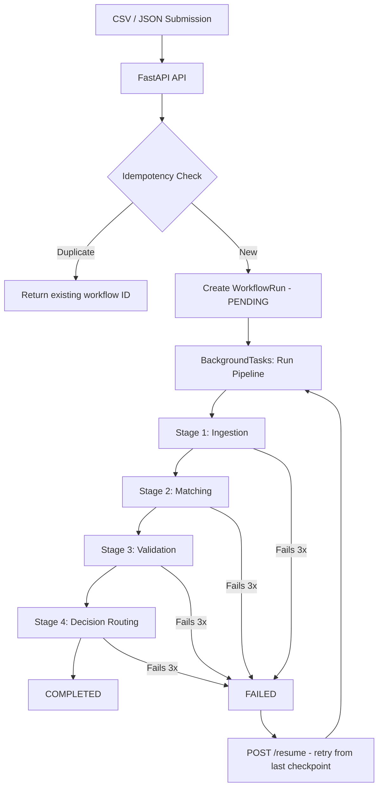

# AR Reconciliation Workflow Engine

Rule-based workflow engine for Accounts Receivable reconciliation with retry, resume, and background execution.

## Architecture



### Pipeline Execution Flow

Each stage in the pipeline:
1. Updates workflow status to `RUNNING`
2. Attempts execution up to `MAX_RETRIES` (3) times
3. On success -> persists result in `workflow_stage_state`, passes enriched data to next stage
4. On failure after all retries -> marks workflow `FAILED` and stops
5. Failed workflows can be resumed from the last successful stage via `POST /resume/{id}`

### Concurrency & ACID Guarantees

- **Idempotency key** (SHA-256 of record data) with a `UNIQUE` DB constraint prevents duplicate records even under concurrent writes
- **IntegrityError handling**: If two processes race past the duplicate check, the DB constraint catches it and the second process gracefully returns `DUPLICATE`
- **Atomic commits**: `ARRecord` + `ProcessedRecord` are committed together - both succeed or neither persists
- **Workflow uniqueness**: `invoice_id` on `workflow_runs` is unique, preventing duplicate workflows for the same customer
- **Session safety**: All background pipeline DB operations use a context manager (`get_db_session()`) that auto-commits on success and auto-rolls-back on any exception - no leaked connections or partial writes
- **Pool health**: SQLAlchemy `pool_pre_ping=True` ensures stale DB connections are detected and recycled

### Failure & Retry Strategy

| Scenario | Handling |
|----------|----------|
| Stage raises exception | Retried up to `MAX_RETRIES` (3) times, each attempt logged |
| All retries exhausted | Workflow marked `FAILED`, stage error persisted |
| Unexpected pipeline crash | Top-level catch-all ensures workflow moves to `FAILED` (never stuck in `RUNNING`) |
| Concurrent duplicate submit | DB constraint catches race; returns existing workflow gracefully |
| DB connection lost mid-pipeline | Context manager rolls back, exception surfaces -> workflow marked `FAILED` |
| Resume after failure | `POST /resume/{id}` reconstructs state from successful stages, resumes from next stage |

## Key Features

- **Background Processing**: FastAPI `BackgroundTasks` processes each workflow pipeline asynchronously
- **Retry Mechanism**: Configurable random failure simulation (20% default) with automatic retry (3 attempts)
- **Resume from Checkpoint**: Failed workflows resume from the last successful stage
- **Idempotency**: Duplicate submissions return the existing workflow ID
- **Bulk Upload**: CSV upload processes each row as an independent workflow in parallel
- **Persistent State**: SQLite (default) or PostgreSQL stores workflow state, stage results, and records
- **Modular Stages**: Ingestion -> Matching -> Validation -> Decision Routing
- **Dashboard & Export**: Stats endpoint, enhanced workflow listing with staleness detection, CSV export

## Stack

| Component | Technology |
|-----------|-----------|
| API | FastAPI |
| Background Processing | FastAPI BackgroundTasks |
| Database | SQLite (default) / PostgreSQL |
| ORM | SQLAlchemy 2.0 |
| Migrations | Alembic |
| Schema Validation | Pydantic v2 |
| Settings | pydantic-settings (`.env` support) |
| Logging | Structlog |
| Build | Hatchling |

## Quick Start

```bash
# Install dependencies
uv pip install -e .

# Run API (auto-creates SQLite DB on startup)
uvicorn app.api.routes:app --reload --port 8000

# Or use main.py
python main.py
```

Services:
- API: http://localhost:8000
- Swagger Docs: http://localhost:8000/docs

### PostgreSQL (optional)

Set environment variables or create a `.env` file:

```env
DB_TYPE=postgresql
POSTGRES_HOST=localhost
POSTGRES_PORT=5432
POSTGRES_USER=postgres
POSTGRES_PASSWORD=secret
POSTGRES_DB=ar_reconciliation
```

## Configuration

| Variable | Default | Description |
|----------|---------|-------------|
| `DB_TYPE` | `sqlite` | Database backend (`sqlite` or `postgresql`) |
| `DATABASE_URL` | `sqlite:///./data/ar_reconciliation.db` | SQLite connection string |
| `FAILURE_RATE` | `0.20` | Simulated random failure probability per stage |
| `MAX_RETRIES` | `3` | Max retry attempts per stage |
| `MATCH_TOLERANCE_PERCENT` | `5.0` | % difference allowed to count as MATCHED |
| `HIGH_VALUE_THRESHOLD` | `10000.0` | Invoice amount above which records are flagged high-value |
| `STALE_MINUTES` | `10` | Failed workflows older than this are marked stale |

## API Endpoints

### Submissions

| Method | Endpoint | Description |
|--------|----------|-------------|
| POST | `/submit` | Submit single AR record (idempotent) |
| PUT | `/submit/{customer_id}` | Update existing record and reprocess |
| POST | `/bulk-upload` | Upload CSV for bulk processing |

### Workflows

| Method | Endpoint | Description |
|--------|----------|-------------|
| GET | `/workflow/{id}` | Get workflow status + all stage details |
| POST | `/resume/{id}` | Resume failed workflow from last checkpoint |
| GET | `/workflows` | List all workflows (filterable by status, paginated) |

### Dashboard

| Method | Endpoint | Description |
|--------|----------|-------------|
| GET | `/stats` | Aggregate counts by status + routing decisions |
| GET | `/workflows/enhanced` | Workflow list with staleness flag and last error |
| GET | `/export` | Download completed results as CSV |

### System

| Method | Endpoint | Description |
|--------|----------|-------------|
| GET | `/health` | Health check |

## Workflow Stages

1. **Ingestion**: Parse record, generate SHA-256 idempotency key, persist to DB
2. **Matching**: Compare invoice vs payment totals (with tolerance) -> `MATCHED` / `PARTIAL` / `OVERPAID` / `OUTSTANDING`
3. **Validation**: Business rule checks - positive amounts, valid exchange rates, required fields
4. **Decision Routing**: Route based on match result + validation outcome -> `AUTO_APPROVED` / `MANUAL_REVIEW` / `FINANCE_REVIEW` / `COLLECTION_QUEUE` / `REJECTED`

### Routing Logic

| Condition | Decision |
|-----------|----------|
| Validation failed | `REJECTED` |
| High-value + not matched | `FINANCE_REVIEW` |
| Matched | `AUTO_APPROVED` |
| Partial payment | `MANUAL_REVIEW` |
| Overpaid | `FINANCE_REVIEW` |
| Outstanding | `COLLECTION_QUEUE` |

## Database Schema

- `workflow_runs` - Tracks each workflow's current state, stage, and retry count
- `workflow_stage_state` - Records each stage execution attempt, output JSON, and errors
- `ar_records` - Persisted AR records from ingestion
- `processed_records` - SHA-256 idempotency key tracking

## Project Structure

```
app/
├── api/
│   ├── routes.py          # FastAPI app, lifespan, middleware, routers
│   ├── submissions.py     # POST /submit, PUT /submit/{id}, POST /bulk-upload
│   ├── workflows.py       # GET /workflow/{id}, POST /resume/{id}, GET /workflows
│   ├── dashboard.py       # GET /stats, /workflows/enhanced, /export
│   └── health.py          # GET /health
├── core/
│   ├── config.py          # Settings via pydantic-settings
│   └── database.py        # SQLAlchemy engine, session, Base
├── database_ops/
│   └── model.py           # ARRecord, ProcessedRecord, WorkflowRun, WorkflowStageState ORM models
├── schemas/
│   └── workflow.py        # Pydantic request/response schemas
└── services/
    ├── pipeline.py        # Stage orchestrator with retry loop
    ├── ingest.py          # Ingestion stage logic
    ├── matching.py        # Matching stage logic
    ├── validation.py      # Validation stage logic
    ├── routing.py         # Decision routing stage logic
    ├── failure_sim.py     # Random failure simulator (POC demo)
    └── workflow_engine.py # Workflow CRUD and state transitions
```

## Example Usage

```bash
# Submit single record
curl -X POST http://localhost:8000/submit \
  -H "Content-Type: application/json" \
  -d '{
    "customer_id": "CUST-0001",
    "customer_name": "Customer 0001",
    "invoice_total": 3892.38,
    "payment_total": 3316.88
  }'

# Upload CSV
curl -X POST http://localhost:8000/bulk-upload \
  -F "file=@data/erp_export.csv"

# Check workflow status
curl http://localhost:8000/workflow/{workflow_id}

# Resume failed workflow
curl -X POST http://localhost:8000/resume/{workflow_id}
```
